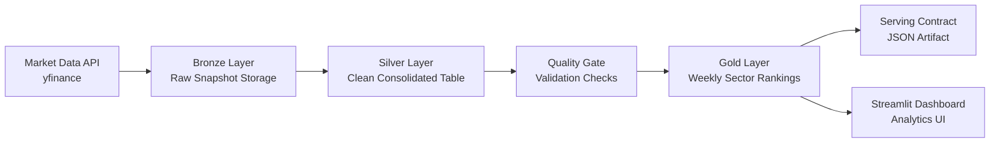

# 📈 Investment Portfolio Management Assistant

A config-driven **investment analytics platform** that automates sector market data ingestion, builds curated analytics datasets using a Bronze–Silver–Gold lakehouse architecture, enforces data quality checks, and delivers insights through an interactive Streamlit dashboard.

The project demonstrates how modern data engineering principles can be applied to financial market analytics to support portfolio decision-making workflows.

---

# 🧭 Business Overview

Investment professionals routinely monitor sector performance to inform asset allocation, risk positioning, and tactical portfolio decisions. However, sector analytics workflows often rely on manual data extraction, fragmented tools, and inconsistent transformation logic.

This project addresses that gap by implementing a lightweight but production-inspired analytics platform that:

* Automates sector market data acquisition
* Standardizes transformation and validation logic
* Produces consistent ranking signals
* Exposes insights through a decision-support dashboard

The system is designed as a foundation for future enhancements such as sector trend forecasting, allocation simulation, and strategy backtesting.

---

# 📊 Dashboard

The Streamlit dashboard provides a lightweight analytics interface for exploration of pipeline outputs.

### Current views

* Sector leaderboard (latest Top-N)
* Return comparison visualization
* Sector trend exploration with selectable time windows

Run locally:

```
PYTHONPATH=. streamlit run dashboard/app.py
```


---

# ⭐ Key Features

* Automated ingestion of sector ETF market data via API
* Layered **Bronze / Silver / Gold** lakehouse architecture
* Config-driven pipeline behavior for reproducibility
* Built-in data quality validation layer
* Weekly sector ranking analytics using rolling performance metrics
* Stable JSON serving artifact for downstream consumers
* Interactive Streamlit dashboard with leaderboard and trend views
* One-command orchestrated pipeline execution

---

# 🏗️ System Architecture


---

### Architecture Summary

The platform follows a layered data flow architecture where raw external data is ingested, curated, validated, transformed into analytics products, and finally exposed through interactive and programmatic interfaces.

---

# 🪵 Data Pipeline Design

## Bronze Layer — Raw Snapshot Storage

Purpose:

* Preserve source fidelity
* Enable reproducibility
* Support historical reprocessing

Characteristics:

* Immutable partitioned snapshots
* Run-date based organization
* Minimal transformation

Path example:

```
data_lake/raw/sector_indexes/run_date=YYYY-MM-DD/
```

---

## Silver Layer — Clean Consolidated Dataset

Purpose:

* Provide a trusted canonical dataset
* Normalize schema
* Remove duplicates

Transformations:

* Schema alignment
* Deduplication (symbol, date)
* Type standardization

Path:

```
data_lake/processed/sector_indexes.parquet
```

---

## Gold Layer — Analytics Mart

Purpose:

* Deliver decision-ready datasets
* Reduce analytical complexity
* Enable consumption by applications

Derived metrics:

* Rolling returns
* Volatility
* Drawdown
* Composite performance score
* Weekly sector ranking

Outputs:

```
data_lake/gold/weekly_sector_rankings.parquet
data_lake/gold/latest_top_sectors.json
```

---

# ⚙️ Orchestration

Pipeline execution is orchestrated through a central runner:

```
python -m src.run_pipeline
```

Execution order:

1. Bronze ingestion
2. Silver build
3. Data quality checks
4. Gold analytics build

This ensures deterministic and reproducible pipeline runs.

---

# 🛡️ Data Quality Layer

Validation rules include:

* Duplicate key detection (symbol, date)
* Missing categorical attribute detection
* Non-negative numeric enforcement
* Freshness SLA validation

Quality checks act as a gate preventing propagation of invalid data into analytics layers.

---

# ⚙️ Configuration

Pipeline behavior is controlled via:

```
configs/config.yaml
```

Configurable parameters include:

* Sector ETF universe
* Storage paths
* Lookback windows
* Ranking weights
* Quality thresholds

This enables environment portability and experimentation without code changes.


# 📁 Project Structure

```
market-data-lakehouse/
  configs/
    config.yaml
  src/
    ingest_sector_indexes_yf.py
    build_sector_indexes_silver.py
    build_sector_rankings_gold.py
    run_pipeline.py
    quality/
      check_sector_indexes.py
    utils/
      config.py
  dashboard/
    app.py
  docs/
  data_lake/ (ignored)
  logs/ (ignored)
```

---

# ▶️ How to Run

## Run full pipeline

```
python -m src.run_pipeline
```

## Run dashboard

```
PYTHONPATH=. streamlit run dashboard/app.py
```

---

# 🧠 Design Decisions

### Lakehouse layering

Adopted Bronze/Silver/Gold structure to enforce separation of concerns between raw storage, trusted datasets, and analytics products.

### Parquet storage

Chosen for efficient columnar storage, compression, and analytical performance.

### Config-driven design

Externalized pipeline parameters to improve reproducibility and reduce coupling between logic and environment.

### Embedded quality gate

Integrated validation within pipeline to emulate production data reliability practices.

### Weekly resampling

Selected weekly aggregation to align with tactical allocation decision cycles rather than daily noise.

### Lightweight orchestration

Script-based orchestration selected for simplicity while preserving conceptual parity with enterprise workflow managers.

---

# 🚀 Roadmap

* Sector trend forecasting module (4-week forward return)
* Forecast-driven Top-N allocation signals
* Walk-forward backtesting framework
* Automated scheduling via GitHub Actions
* Additional dashboard analytics views
* Strategy comparison vs benchmark

---

# ⭐ Learning Outcomes

This project demonstrates practical application of:

* Data lakehouse architecture
* Pipeline orchestration patterns
* Config-driven system design
* Data quality enforcement
* Financial analytics transformation
* Analytics product serving

---

# 📬 Author

Yuvraj Lal
Machine Learning & Data Analytics Graduate
Portfolio project exploring data engineering and financial analytics integration
